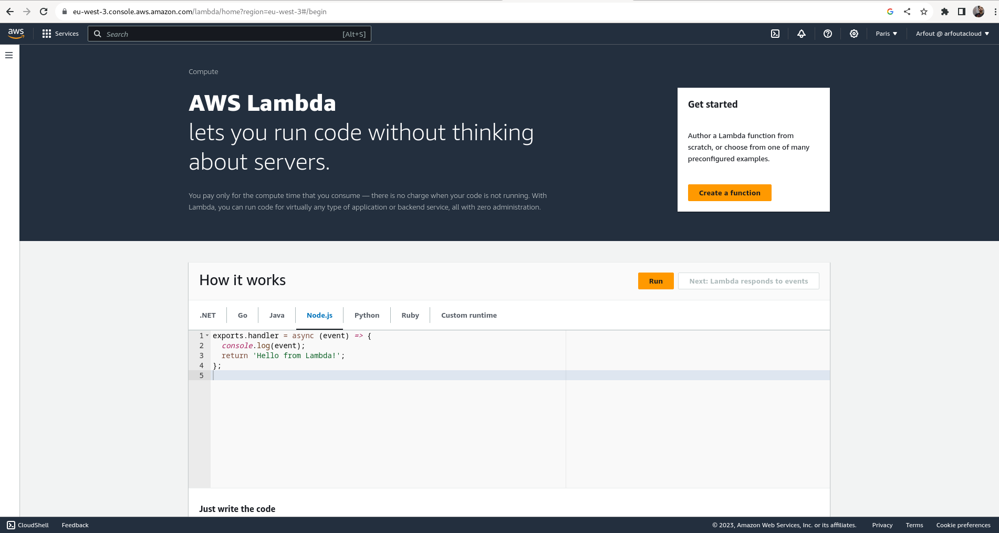
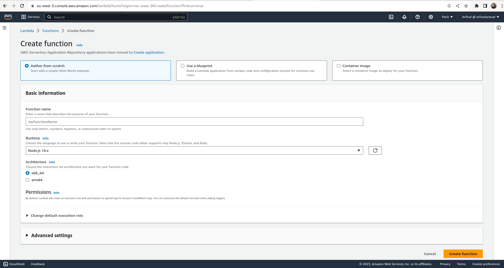
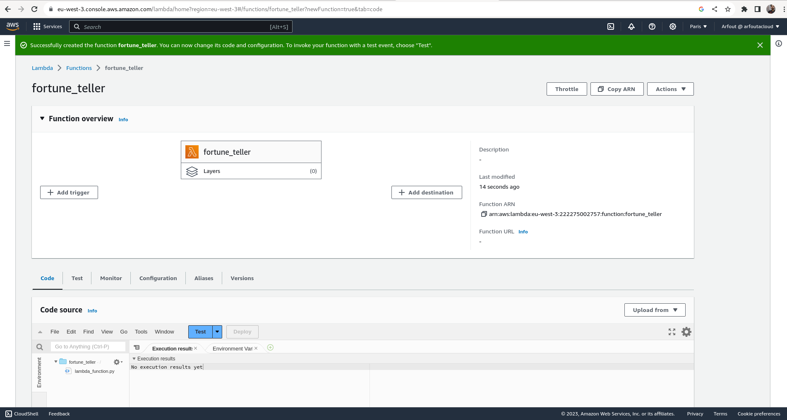
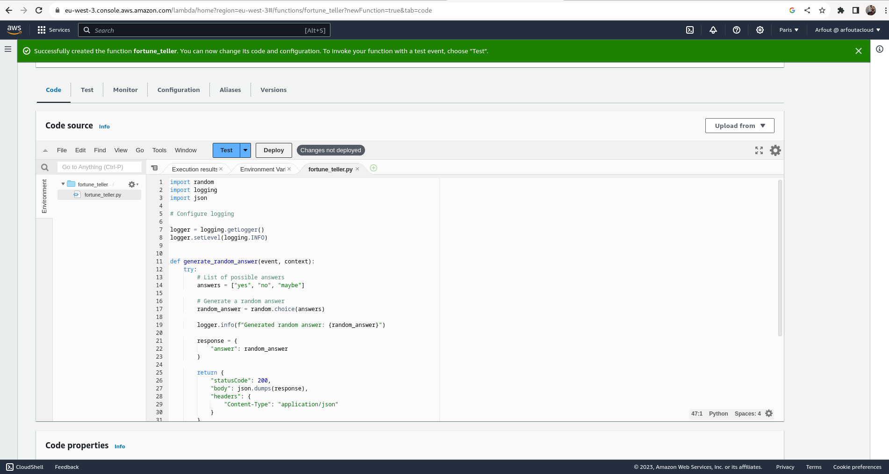
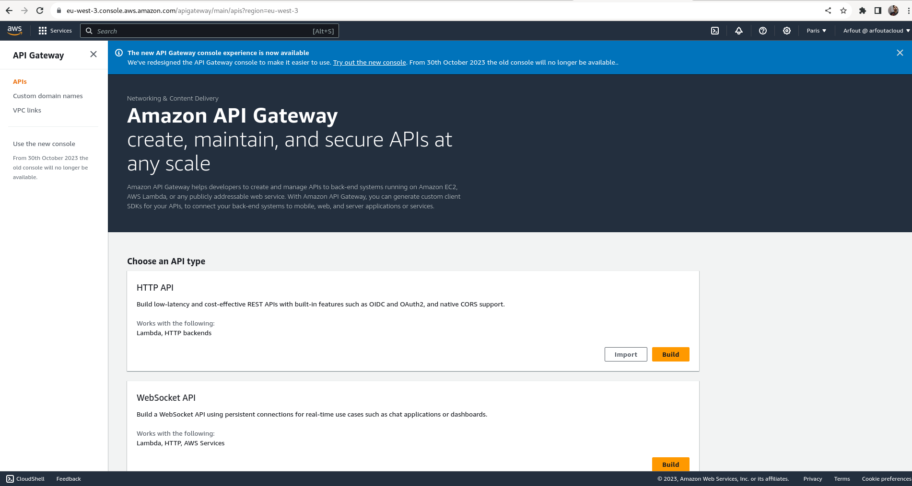
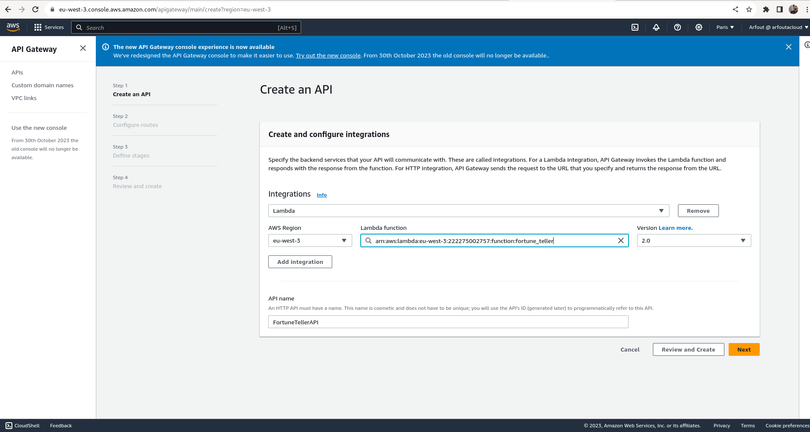
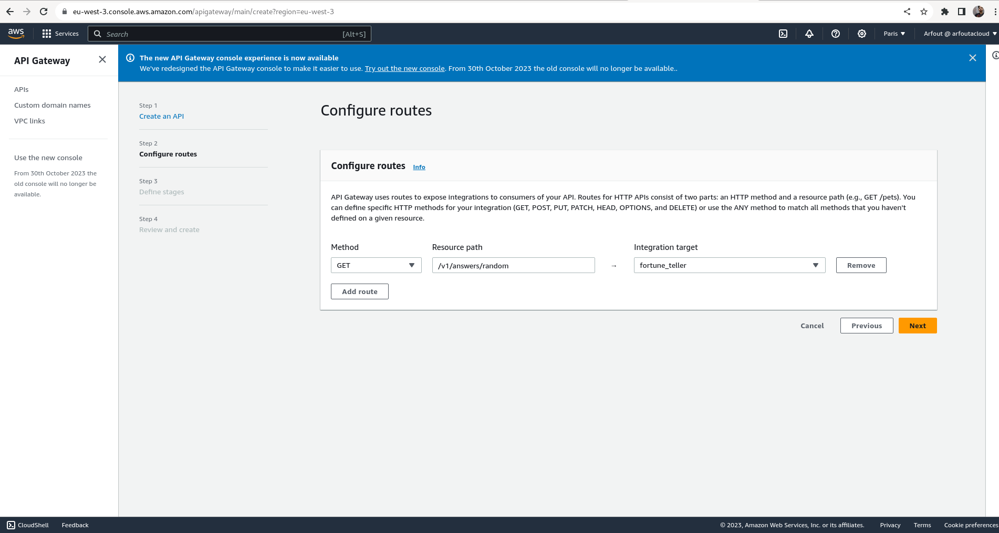

## Fortune Teller

### Introduction
This project is a simple serverless application that returns random responses (Yes,No,Maybe) to Yes/No questions.
It provides a comprehensive example of **building**, **testing**, and **deploying** an application using **Aws Lambda** and **API Gateway**.

### Features

* Serverless function using Aws Lambda
* API built with API Gateway Service to trigger the lambda function

### Prerequisites

- An Aws Account
- An Internet Connection

### Getting Started

#### Create and configure aws lambda function

- **Step 1 :**  Open Aws Lambda Management Console

- **Step 2 :**  Choose Name and Runtime Environment 

- **Step 3 :**  Optional : Rename "lambda_function" file to fortune_teller 

- **Step 4 :**  Copy and Paste the Function Code into the Code Box and Click Deploy

- **Step 5 :**  Change the Runtime settings

- **Step 6 :**  Test the lambda function

#### Create and Configure Aws APi Gateway

- **Step 1 :**  Open Aws API Gateway Management Console

- **Step 2 :**  Choose a Name and Integrate with the Lambda Function

- **Step 3 :**  Configure API Route

- **Step 4 :**  Review and Create

